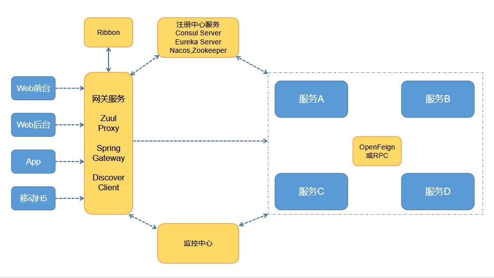

Spring Cloud 微服务示例
=====================

* 根据业务模块划分服务种类
* 每个服务可独立部署且相互隔离
* 通过轻量级API调用服务
* 服务需保证良好的高可用

## 一、工程说明

### 模块说明

- [springcloud-discovery-module](https://github.com/cjp1016/springcloud-examples/tree/master/springcloud-discovery-module/) : 微服务注册中心模块：Eureka、Consul
- [springcloud-gateway-module](https://github.com/cjp1016/springcloud-examples/tree/master/springcloud-gateway-module/) : 微服务网关模块：Zuul、Gateway
- [springcloud-monitor-module](https://github.com/cjp1016/springcloud-examples/tree/master/springcloud-monitor-module/) : 微服务监控模块
- [springcloud-server-consumer](https://github.com/cjp1016/springcloud-examples/tree/master/springcloud-server-consumer) : 微服务消费者
- [springcloud-server-provider](https://github.com/cjp1016/springcloud-examples/tree/master/springcloud-server-provider/) : 微服务提供者

### 整体架构图

## 二、版本说明

核心发布说明：

* [https://github.com/spring-projects/spring-cloud/wiki](https://github.com/spring-projects/spring-cloud/wiki)

版本说明：

* [https://github.com/spring-cloud/spring-cloud-release/releases](https://github.com/spring-cloud/spring-cloud-release/releases)

* [https://github.com/spring-cloud/spring-cloud-release/milestones](https://github.com/spring-cloud/spring-cloud-release/milestones)

| SpringCloud版本               | SpringBoot版本 | 发布说明                                                     | 发布时间   |
| ----------------------------- | -------------- | ------------------------------------------------------------ | ---------- |
| Greenwich SR2  GA 格林威治 镇 | 2.1.6.RELEASE  | [Spring-Cloud-Greenwich-Release-Notes](https://github.com/spring-projects/spring-cloud/wiki/Spring-Cloud-Greenwich-Release-Notes) | 2019-06-21 |
| Finchley SR4 GA  芬奇利 市    | 2.0.9.RELEASE  | [Spring-Cloud-Finchley-Release-Notes](https://github.com/spring-projects/spring-cloud/wiki/Spring-Cloud-Finchley-Release-Notes) | 2019-06-08 |
| Edgware SR6 GA  艾奇韦尔 站   | 1.5.21.RELEASE | [Spring-Cloud-Edgware-Release-Notes](https://github.com/spring-projects/spring-cloud/wiki/Spring-Cloud-Edgware-Release-Notes) | 2019-05-23 |
| Dalston SR5 GA  达尔斯顿 区   | 1.5.4.RELEASE  | [Spring-Cloud-Dalston-Release-Notes](https://github.com/spring-projects/spring-cloud/wiki/Spring-Cloud-Dalston-Release-Notes) | 2017-12-26 |

Spring Cloud Finchley builds on Spring Boot 2.0.x and is not compatible with 1.x.y.

spring cloud 发布官方文档地址：

* [https://cloud.spring.io/spring-cloud-static/Greenwich.SR2/single/spring-cloud.html](https://cloud.spring.io/spring-cloud-static/Greenwich.SR2/single/spring-cloud.html)

* [https://cloud.spring.io/spring-cloud-static/Finchley.SR4/single/spring-cloud.html](https://cloud.spring.io/spring-cloud-static/Finchley.SR4/single/spring-cloud.html)
* [https://cloud.spring.io/spring-cloud-static/Edgware.SR6/single/spring-cloud.html](https://cloud.spring.io/spring-cloud-static/Edgware.SR6/single/spring-cloud.html)

* [https://cloud.spring.io/spring-cloud-static/Dalston.SR5/single/spring-cloud.html](https://cloud.spring.io/spring-cloud-static/Dalston.SR5/single/spring-cloud.html)