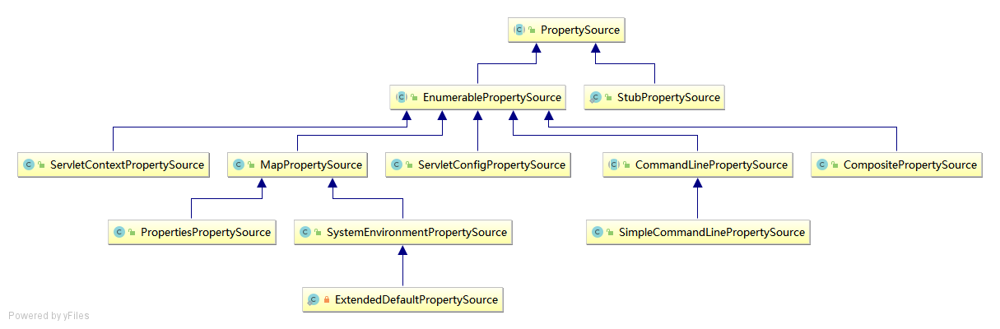
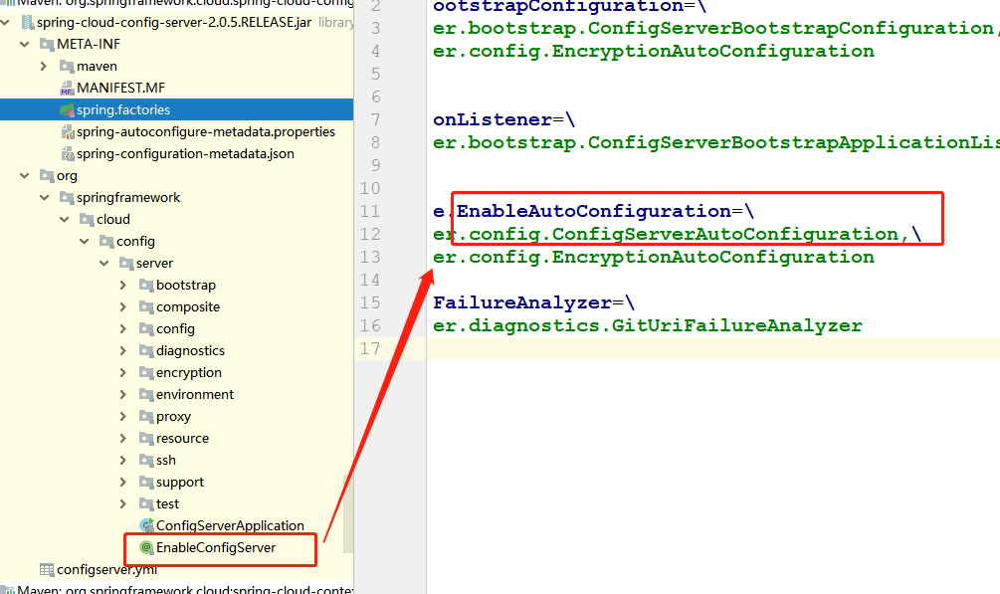
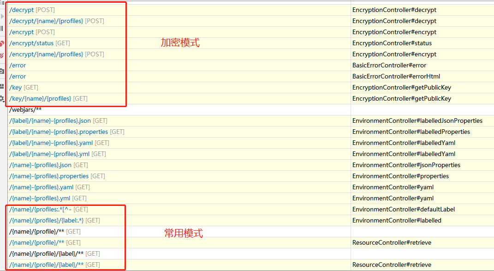
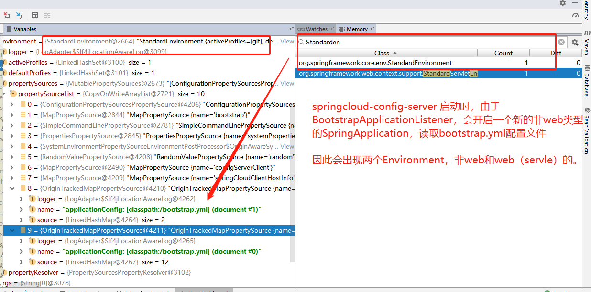
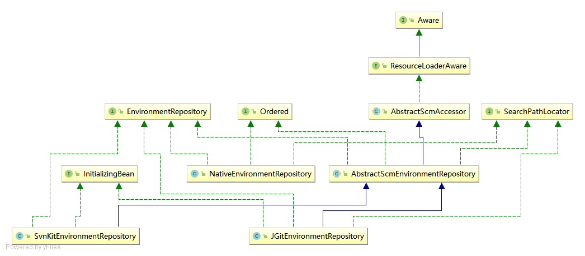

springcloud-config
======================

官方文档

* `Greenwich.SR2`

  [https://cloud.spring.io/spring-cloud-static/spring-cloud-config/2.1.3.RELEASE/single/spring-cloud-config.html](https://cloud.spring.io/spring-cloud-static/spring-cloud-config/2.1.3.RELEASE/single/spring-cloud-config.html)

* `SpringCloud：Finchley SR4`

  [https://cloud.spring.io/spring-cloud-static/spring-cloud-config/2.0.5.RELEASE/single/spring-cloud-config.html](https://cloud.spring.io/spring-cloud-static/spring-cloud-config/2.0.5.RELEASE/single/spring-cloud-config.html)

前提知识：`bootstrap context ` 引入了`spring-cloud-context` 这个包就会被创建.

具体查看:[BootstrapApplicationListener](#BootstrapApplicationListener)

## 服务端源码分析

读取配置的核心点是：[EnvironmentRepository](#EnvironmentRepository) 和 [业务逻辑调用链](#业务逻辑调用链)

pom.xml  配置

```xml
<!-- 配置中心服务端 -->
<dependency>
	<groupId>org.springframework.cloud</groupId>
	<artifactId>spring-cloud-config-server</artifactId>
</dependency>
```

`application.yml` 配置

```yaml
spring:
  application:
    name: springcloud-config-sever
  profiles:
    active: git

server:
  port: 8888

# management 开启端口
management:
  server:
    port: 8880
    ssl:
      enabled: false
  endpoints:
    web:
      exposure:
        include: '*'
  endpoint:
    shutdown:
      enabled: true

# git 方式
---
spring:
  profiles: git
  cloud:
    config:
      server:
        git:
          uri : file:///D:/config-file/config-repo


# native 方式，目录需以/结尾
---
spring:
  profiles: native
  cloud:
    config:
      server:
        native:
          search-locations: D:/config-file/config-repo-native/
          default-label: branch
```

### 环境变量配置说明

可以采用bootstrap.yml（存放固定信息）配置-会打包大jar里面，替换application.yml（存放变量信息）配置信息。

运行时忽略网卡配置：`--spring.cloud.inetutils.ignoredInterfaces=docker.*,veth.*,.*Virtual.*`

在Program arguments 输入上述参数。

读取参数配置监听器有:

```properties
# spring-cloud-config-server-2.1.3.RELEASE.jar!\META-INF\spring.factories 
# 配置： configServerClient
org.springframework.context.ApplicationListener=\
org.springframework.cloud.config.server.bootstrap.ConfigServerBootstrapApplicationListener 

# 注意引入了bootstrap context这个概念，非常重要
# spring-cloud-context-2.1.2.RELEASE.jar!\META-INF\spring.factories
org.springframework.context.ApplicationListener=\
org.springframework.cloud.bootstrap.BootstrapApplicationListener,\
```

environment环境变量配置排序：

```properties
# 命令行
commandLineArgs: 类型是：SimpleCommandLinePropertySource，继承CommandLinePropertySource
# servlet嵌入式容器
servletConfigInitParams: 类型是： StubPropertySource，继承PropertySource抽象类
servletContextInitParams: 类型是： StubPropertySource，继承PropertySource抽象类
# java系统参数：jdk版本，系统版本，user.home，user.dir
systemProperties: 类型是：PropertiesPropertySource，继承MapPropertySource
# 主机环境变量配置：path,classpath,M2_HOME
systemEnvironment: 类型是：SystemEnvironmentPropertySource，继承MapPropertySource
# springcloud-config-server 分布式服务配置
configServerClient: 类型是：MapPropertySource
# 采用BootstrapApplicationListener 读取bootstap.yml 属性配置，
# 内部启动StandardEnvironment合并到StandardServletEnvironment
defaultProperties: 类型是：ExtendedDefaultPropertySource，继承SystemEnvironmentPropertySource
```

#### PropertySource<T> 抽象类子类

使用 `@PropertySource`




### 主目录结构



### 启动类分析

开启配置中心服务端`@EnableConfigServer` ，

核心自动装配类 ：`ConfigServerAutoConfiguration`   

加密自动装配 ： `EncryptionAutoConfiguration` 

```java
@SpringBootApplication
@EnableConfigServer
public class ConfigServerApplication {
	...
}
```

`@EnableConfigServer` 注解类，引入`ConfigServerConfiguration`配置

```java
@Target(ElementType.TYPE)
@Retention(RetentionPolicy.RUNTIME)
@Documented
@Import(ConfigServerConfiguration.class)
public @interface EnableConfigServer {

}
```

`ConfigServerConfiguration` 配置类，实例化Marker对象。Marker是**自动装配的条件类**

```java
@Configuration
public class ConfigServerConfiguration {
	class Marker {}

	@Bean
	public Marker enableConfigServerMarker() {
		return new Marker();
	}
}
```

#### ConfigServerAutoConfiguration

配置中心服务端自动装配类

```java
// 1. 条件装配：Marker对象
// 2. 注入ConfigServer配置属性：ConfigServerProperties
// 3. 引入配置类：EnvironmentRepositoryConfiguration(重点)
@Configuration
@ConditionalOnBean(ConfigServerConfiguration.Marker.class)
@EnableConfigurationProperties(ConfigServerProperties.class)
@Import({ EnvironmentRepositoryConfiguration.class, CompositeConfiguration.class, ResourceRepositoryConfiguration.class,
		ConfigServerEncryptionConfiguration.class, ConfigServerMvcConfiguration.class })
public class ConfigServerAutoConfiguration {

}
```

知识回顾：

**`@EnableConfigurationProperties`**

如果一个配置类只配置`@ConfigurationProperties`注解，而没有使用`@Component`，那么在ioc容器中是获取不到properties 配置文件转化的bean。而`@EnableConfigurationProperties` 相当于把仅使用  `@ConfigurationProperties` 的配置类进行了一次Bean注入。


#### EnvironmentRepositoryConfiguration

环境仓库配置类

```java
/**
 * 1. 引入配置属性:svn，jdbc，native，Vault
 * 2. 引入7中配置类：对应SpringCloud Config支持模式
 */
@Configuration
@EnableConfigurationProperties({ SvnKitEnvironmentProperties.class,
		JdbcEnvironmentProperties.class, NativeEnvironmentProperties.class, VaultEnvironmentProperties.class })
@Import({ CompositeRepositoryConfiguration.class, JdbcRepositoryConfiguration.class, VaultRepositoryConfiguration.class,
		SvnRepositoryConfiguration.class, NativeRepositoryConfiguration.class, GitRepositoryConfiguration.class,
		DefaultRepositoryConfiguration.class })
public class EnvironmentRepositoryConfiguration {

// 本地模式
@Configuration
@ConditionalOnMissingBean(EnvironmentRepository.class)
@Profile("native")
class NativeRepositoryConfiguration {

	@Bean
	public NativeEnvironmentRepository nativeEnvironmentRepository(NativeEnvironmentRepositoryFactory factory,
			NativeEnvironmentProperties environmentProperties) {
		return factory.build(environmentProperties);
	}
}

// Git模式
@Configuration
@Profile("git")
class GitRepositoryConfiguration extends DefaultRepositoryConfiguration {
}


// SVN模式
@Configuration
@Profile("subversion")
class SvnRepositoryConfiguration {

	@Bean
	public SvnKitEnvironmentRepository svnKitEnvironmentRepository(SvnKitEnvironmentProperties environmentProperties,
                                                                   SvnEnvironmentRepositoryFactory factory) {
		return factory.build(environmentProperties);
	}
}

// vault模式(保险库https://learn.hashicorp.com/vault)
@Configuration
@Profile("vault")
class VaultRepositoryConfiguration {

	@Bean
	public VaultEnvironmentRepository vaultEnvironmentRepository(VaultEnvironmentRepositoryFactory factory,
                                                                 VaultEnvironmentProperties environmentProperties)
            throws Exception {
		return factory.build(environmentProperties);
	}
}

// jdbc模式
@Configuration
@Profile("jdbc")
@ConditionalOnClass(JdbcTemplate.class)
class JdbcRepositoryConfiguration {

	@Bean
	@ConditionalOnBean(JdbcTemplate.class)
	public JdbcEnvironmentRepository jdbcEnvironmentRepository(JdbcEnvironmentRepositoryFactory factory,
															   JdbcEnvironmentProperties environmentProperties) {
		return factory.build(environmentProperties);
	}
}

// composite模式(组合模式)
@Configuration
@Profile("composite")
class CompositeRepositoryConfiguration {

}

}
```


### API接口分析



`EnvironmentController` 源码，前缀配置默认为空，可以再配置指定。

```java
@RestController
@RequestMapping(method = RequestMethod.GET, path = "${spring.cloud.config.server.prefix:}")
public class EnvironmentController {
	
	// 核心接口类,实现类：EnvironmentEncryptorEnvironmentRepository
	private EnvironmentRepository repository;
	private ObjectMapper objectMapper;

	private boolean stripDocument = true;
	private boolean acceptEmpty = true;
	// 构造注入对象
	public EnvironmentController(EnvironmentRepository repository) {
		this(repository, new ObjectMapper());
	}

	public EnvironmentController(EnvironmentRepository repository,
			ObjectMapper objectMapper) {
		this.repository = repository;
		this.objectMapper = objectMapper;
	}

	// 请求路径：`/项目名/profile/`
	@RequestMapping("/{name}/{profiles:.*[^-].*}")
	public Environment defaultLabel(@PathVariable String name,
			@PathVariable String profiles) {
		return labelled(name, profiles, null);
	}

	// 请求路径(label对应git的分支，可以对应native的文件夹（文件夹需要指定label属性）)：`/项目名/profile/label`
	@RequestMapping("/{name}/{profiles}/{label:.*}")
	public Environment labelled(@PathVariable String name, @PathVariable String profiles,
			@PathVariable String label) {
		if (name != null && name.contains("(_)")) {
			// "(_)" is uncommon in a git repo name, but "/" cannot be matched
			// by Spring MVC
			name = name.replace("(_)", "/");
		}
		if (label != null && label.contains("(_)")) {
			// "(_)" is uncommon in a git branch name, but "/" cannot be matched
			// by Spring MVC
			label = label.replace("(_)", "/");
		}
		Environment environment = this.repository.findOne(name, profiles, label);
		if(!acceptEmpty && (environment == null || environment.getPropertySources().isEmpty())){
			 throw new EnvironmentNotFoundException("Profile Not found");
		}
		return environment;
	}
	
}
	
```

#### ConfigServerMvcConfiguration

```java
@Configuration
@ConditionalOnWebApplication
public class ConfigServerMvcConfiguration extends WebMvcConfigurerAdapter {

	@Autowired(required = false)
	private EnvironmentEncryptor environmentEncryptor;

	@Autowired(required = false)
	private ObjectMapper objectMapper = new ObjectMapper();
	
	// 配置请求内容协商
	@Override
	public void configureContentNegotiation(ContentNegotiationConfigurer configurer) {
		configurer.mediaType("properties", MediaType.valueOf("text/plain"));
		configurer.mediaType("yml", MediaType.valueOf("text/yaml"));
		configurer.mediaType("yaml", MediaType.valueOf("text/yaml"));
	}
	
	// 注入EnvironmentEncryptorEnvironmentRepository和ObjectMapper给EnvironmentController
	@Bean
	public EnvironmentController environmentController(EnvironmentRepository envRepository, ConfigServerProperties server) {
		EnvironmentController controller = new EnvironmentController(encrypted(envRepository, server), this.objectMapper);
		controller.setStripDocumentFromYaml(server.isStripDocumentFromYaml());
		controller.setAcceptEmpty(server.isAcceptEmpty());
		return controller;
	}

	@Bean
	@ConditionalOnBean(ResourceRepository.class)
	public ResourceController resourceController(ResourceRepository repository, EnvironmentRepository envRepository, ConfigServerProperties server) {
		ResourceController controller = new ResourceController(repository,
				encrypted(envRepository, server));
		return controller;
	}
	
    // 实例化EnvironmentEncryptorEnvironmentRepository
	private EnvironmentRepository encrypted(EnvironmentRepository envRepository, ConfigServerProperties server) {
		EnvironmentEncryptorEnvironmentRepository encrypted = new EnvironmentEncryptorEnvironmentRepository(
				envRepository, this.environmentEncryptor);
		encrypted.setOverrides(server.getOverrides());
		return encrypted;
	}
}
```

#### 接口请求方式参考

```shell
http://localhost:8888/order/dev # /项目名/profile
# 在本地模式，服务端需要指定label，默认分支是master
http://localhost:8888/order/dev/master # /项目名/profile/label
```

#### 业务逻辑调用链

`EnvironmentEncryptorEnvironmentRepository` --> `CompositeEnvironmentRepository` -->  `NativeEnvironmentRepository`  核心方法：`findOne(String application, String profile, String label)`

```java
public class NativeEnvironmentRepository
		implements EnvironmentRepository, SearchPathLocator, Ordered {
	
	// 采用SpringBootAplication启动，使用ConfigFileApplicationListener事件获取指定位置配置
	@Override
	public Environment findOne(String config, String profile, String label) {
		SpringApplicationBuilder builder = new SpringApplicationBuilder(
				PropertyPlaceholderAutoConfiguration.class);
		ConfigurableEnvironment environment = getEnvironment(profile);
		builder.environment(environment);
		builder.web(WebApplicationType.NONE).bannerMode(Mode.OFF);
		if (!logger.isDebugEnabled()) {
			// Make the mini-application startup less verbose
			builder.logStartupInfo(false);
		}
		String[] args = getArgs(config, profile, label);
		// Explicitly set the listeners (to exclude logging listener which would change
		// log levels in the caller)
		builder.application()
				.setListeners(Arrays.asList(new ConfigFileApplicationListener()));
		ConfigurableApplicationContext context = builder.run(args);
		environment.getPropertySources().remove("profiles");
		try {
			return clean(new PassthruEnvironmentRepository(environment).findOne(config,
					profile, label));
		}
		finally {
			context.close();
		}
	}
		
	// SpringBoot启动参数，指定外部化配置文件地址:spring.config.location
	private String[] getArgs(String application, String profile, String label) {
		List<String> list = new ArrayList<String>();
		String config = application;
		if (!config.startsWith("application")) {
			config = "application," + config;
		}
		list.add("--spring.config.name=" + config);
		list.add("--spring.cloud.bootstrap.enabled=false");
		list.add("--encrypt.failOnError=" + this.failOnError);
		list.add("--spring.config.location=" + StringUtils.arrayToCommaDelimitedString(
				getLocations(application, profile, label).getLocations()));
		return list.toArray(new String[0]);
	}
}	
```


### BootstrapApplicationListener

spring-cloud-context包内，读取`bootstrap.properties/yml` 配置文件。开启一个spring application上下文处理。

```java
/**
 * A listener that prepares a SpringApplication (e.g. populating its Environment) by
 * delegating to {@link ApplicationContextInitializer} beans in a separate bootstrap
 * context. The bootstrap context is a SpringApplication created from sources defined in
 * spring.factories as {@link BootstrapConfiguration}, and initialized with external
 * config taken from "bootstrap.properties" (or yml), instead of the normal
 * "application.properties".
 *
 * @author Dave Syer
 *
 */
public class BootstrapApplicationListener
		implements ApplicationListener<ApplicationEnvironmentPreparedEvent>, Ordered {

	/**
	 * Property source name for bootstrap.
	 */
	public static final String BOOTSTRAP_PROPERTY_SOURCE_NAME = "bootstrap";

	/**
	 * The default order for this listener.
	 */
	public static final int DEFAULT_ORDER = Ordered.HIGHEST_PRECEDENCE + 5;

	/**
	 * The name of the default properties.
	 */
	public static final String DEFAULT_PROPERTIES = "defaultProperties";

	private int order = DEFAULT_ORDER;

	@Override
	public void onApplicationEvent(ApplicationEnvironmentPreparedEvent event) {
		ConfigurableEnvironment environment = event.getEnvironment();
		if (!environment.getProperty("spring.cloud.bootstrap.enabled", Boolean.class,
				true)) {
			return;
		}
		// don't listen to events in a bootstrap context
		if (environment.getPropertySources().contains(BOOTSTRAP_PROPERTY_SOURCE_NAME)) {
			return;
		}
		ConfigurableApplicationContext context = null;
		String configName = environment
				.resolvePlaceholders("${spring.cloud.bootstrap.name:bootstrap}");
		// 开启BootstrapService上下文
		context = bootstrapServiceContext(environment, event.getSpringApplication(),
					configName);
		event.getSpringApplication()
					.addListeners(new CloseContextOnFailureApplicationListener(context));
		

		apply(context, event.getSpringApplication(), environment);
	}


	private ConfigurableApplicationContext bootstrapServiceContext(
			ConfigurableEnvironment environment, final SpringApplication application,
			String configName) {
		StandardEnvironment bootstrapEnvironment = new StandardEnvironment();
		MutablePropertySources bootstrapProperties = bootstrapEnvironment
				.getPropertySources();
		for (PropertySource<?> source : bootstrapProperties) {
			bootstrapProperties.remove(source.getName());
		}
		String configLocation = environment
				.resolvePlaceholders("${spring.cloud.bootstrap.location:}");
		Map<String, Object> bootstrapMap = new HashMap<>();
		bootstrapMap.put("spring.config.name", configName);
		
		bootstrapMap.put("spring.main.web-application-type", "none");
		if (StringUtils.hasText(configLocation)) {
			bootstrapMap.put("spring.config.location", configLocation);
		}
		bootstrapProperties.addFirst(
				new MapPropertySource(BOOTSTRAP_PROPERTY_SOURCE_NAME, bootstrapMap));
		for (PropertySource<?> source : environment.getPropertySources()) {
			if (source instanceof StubPropertySource) {
				continue;
			}
			bootstrapProperties.addLast(source);
		}
		// 启动一个新的SpringApplication，获取上下文，配置信息
		SpringApplicationBuilder builder = new SpringApplicationBuilder()
				.profiles(environment.getActiveProfiles()).bannerMode(Mode.OFF)
				.environment(bootstrapEnvironment)
				.registerShutdownHook(false).logStartupInfo(false)
				.web(WebApplicationType.NONE);
		final SpringApplication builderApplication = builder.application();
		if (builderApplication.getMainApplicationClass() == null) {
		
			builder.main(application.getMainApplicationClass());
		}
		if (environment.getPropertySources().contains("refreshArgs")) {

			builderApplication
					.setListeners(filterListeners(builderApplication.getListeners()));
		}
        // Bootstrap Context 设置启动类
		builder.sources(BootstrapImportSelectorConfiguration.class);
		final ConfigurableApplicationContext context = builder.run();
		
		context.setId("bootstrap");
		addAncestorInitializer(application, context);
		bootstrapProperties.remove(BOOTSTRAP_PROPERTY_SOURCE_NAME);
		mergeDefaultProperties(environment.getPropertySources(), bootstrapProperties);
		return context;
	}

	private Collection<? extends ApplicationListener<?>> filterListeners(
			Set<ApplicationListener<?>> listeners) {
		Set<ApplicationListener<?>> result = new LinkedHashSet<>();
		for (ApplicationListener<?> listener : listeners) {
			if (!(listener instanceof LoggingApplicationListener)
					&& !(listener instanceof LoggingSystemShutdownListener)) {
				result.add(listener);
			}
		}
		return result;
	}

	private void mergeDefaultProperties(MutablePropertySources environment,
			MutablePropertySources bootstrap) {
		String name = DEFAULT_PROPERTIES;
		...
		mergeAdditionalPropertySources(environment, bootstrap);
	}

	private void mergeAdditionalPropertySources(MutablePropertySources environment,
			MutablePropertySources bootstrap) {
		addOrReplace(environment, result);
		addOrReplace(bootstrap, result);
	}

	private void addOrReplace(MutablePropertySources environment,
			PropertySource<?> result) {
		if (environment.contains(result.getName())) {
			environment.replace(result.getName(), result);
		}
		else {
			environment.addLast(result);
		}
	}

	private void addAncestorInitializer(SpringApplication application,
			ConfigurableApplicationContext context) {
		boolean installed = false;
		for (ApplicationContextInitializer<?> initializer : application
				.getInitializers()) {
			if (initializer instanceof AncestorInitializer) {
				installed = true;
				// New parent
				((AncestorInitializer) initializer).setParent(context);
			}
		}
		if (!installed) {
			application.addInitializers(new AncestorInitializer(context));
		}

	}

	private void apply(ConfigurableApplicationContext context,
			SpringApplication application, ConfigurableEnvironment environment) {


		addBootstrapDecryptInitializer(application);
	}

	private void addBootstrapDecryptInitializer(SpringApplication application) {
		DelegatingEnvironmentDecryptApplicationInitializer decrypter = null;
		for (ApplicationContextInitializer<?> ini : application.getInitializers()) {
			if (ini instanceof EnvironmentDecryptApplicationInitializer) {
				@SuppressWarnings("unchecked")
				ApplicationContextInitializer del = (ApplicationContextInitializer) ini;
				decrypter = new DelegatingEnvironmentDecryptApplicationInitializer(del);
			}
		}
		if (decrypter != null) {
			application.addInitializers(decrypter);
		}
	}


	private static class AncestorInitializer implements
			ApplicationContextInitializer<ConfigurableApplicationContext>, Ordered {

		private ConfigurableApplicationContext parent;
		...

	}

	/**
	 * A special initializer designed to run before the property source bootstrap and
	 * decrypt any properties needed there (e.g. URL of config server).
	 */
	@Order(Ordered.HIGHEST_PRECEDENCE + 9)
	private static class DelegatingEnvironmentDecryptApplicationInitializer
			implements ApplicationContextInitializer<ConfigurableApplicationContext> {

		...

	}

	private static class ExtendedDefaultPropertySource
			extends SystemEnvironmentPropertySource {

		private final CompositePropertySource sources;

		...
	
	}

	private static class CloseContextOnFailureApplicationListener
			implements SmartApplicationListener {
		...

	}

}

```

#### bootstrap.yml 读取




### EnvironmentRepository



#### Git和SVN读取配置

`SvnKitEnvironmentRepository` 和 `SvnKitEnvironmentRepository`  和都继承了 `AbstractScmEnvironmentRepository`

```java
public abstract class AbstractScmEnvironmentRepository extends AbstractScmAccessor
		implements EnvironmentRepository, SearchPathLocator, Ordered {

	private EnvironmentCleaner cleaner = new EnvironmentCleaner();
	private int order = Ordered.LOWEST_PRECEDENCE;

	public AbstractScmEnvironmentRepository(ConfigurableEnvironment environment) {
		super(environment);
	}

	public AbstractScmEnvironmentRepository(ConfigurableEnvironment environment, AbstractScmAccessorProperties properties) {
		super(environment, properties);
		this.order = properties.getOrder();
	}

	@Override
	public synchronized Environment findOne(String application, String profile, String label) {
		// 采用本地NativeEnvironmentRepository方式
		NativeEnvironmentRepository delegate = new NativeEnvironmentRepository(getEnvironment(),
				new NativeEnvironmentProperties());
		Locations locations = getLocations(application, profile, label);
		delegate.setSearchLocations(locations.getLocations());
		Environment result = delegate.findOne(application, profile, "");
		result.setVersion(locations.getVersion());
		result.setLabel(label);
		return this.cleaner.clean(result, getWorkingDirectory().toURI().toString(),
				getUri());
	}
}
```


## 客户端源码分析

原来客户端application.yml配置如下

```yaml
# info 信息,springboot 将占位符修改为@...@格式
info:
  app:
    groupId: @project.groupId@
    artifactId: @project.artifactId@
    version: @project.version@

spring:
  application:
    name: @project.artifactId@
  cloud:
    inetutils:
      ignored-interfaces: docker.*,veth.*,.*Virtual.*

server:
  port: 9091

# eureka 注册中心
eureka:
  instance:
    prefer-ip-address: true
  client:
    service-url:
      defaultZone: http://192.168.18.110:8761/eureka/


```

采用springcloud-config 配置后。pom.xml 推荐配置 `spring-cloud-config-client ` ，当然最方便的是

`org.springframework.cloud:spring-cloud-starter-config`.