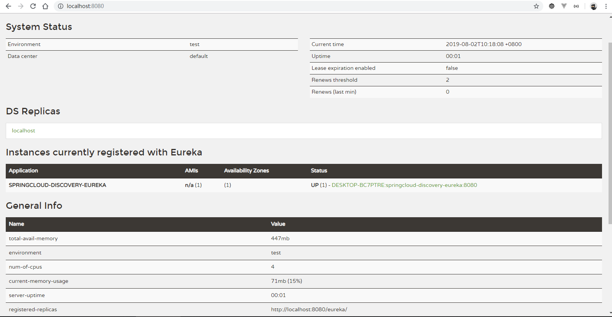
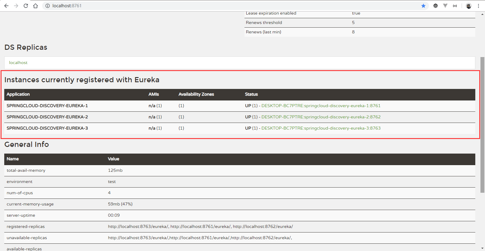

springcloud-discovery-eureka
=======================

## server服务端配置

### pom.xml 配置

#### parent父模块的pom.xml配置

```xml
<?xml version="1.0" encoding="UTF-8"?>
<project xmlns="http://maven.apache.org/POM/4.0.0"
         xmlns:xsi="http://www.w3.org/2001/XMLSchema-instance"
         xsi:schemaLocation="http://maven.apache.org/POM/4.0.0 http://maven.apache.org/xsd/maven-4.0.0.xsd">
    <modelVersion>4.0.0</modelVersion>

    <groupId>cn.selinx</groupId>
    <artifactId>springcloud-examples</artifactId>
    <packaging>pom</packaging>
    <version>0.0.1</version>

    <!-- 提供SpringBoot依赖 -->
    <parent>
        <groupId>org.springframework.boot</groupId>
        <artifactId>spring-boot-starter-parent</artifactId>
        <version>2.0.9.RELEASE</version>
        <relativePath />
    </parent>

	<!-- 提供SpringCloud依赖 -->
    <dependencyManagement>
        <dependencies>
            <dependency>
                <groupId>org.springframework.cloud</groupId>
                <artifactId>spring-cloud-dependencies</artifactId>
                <version>Finchley.SR4</version>
                <type>pom</type>
                <scope>import</scope>
            </dependency>
        </dependencies>
    </dependencyManagement>

    <modules>
        <module>springcloud-discovery-eureka</module>
    </modules>
    
</project>
```

#### server子模块的pom.xml配置

```xml
<?xml version="1.0" encoding="UTF-8"?>
<project xmlns="http://maven.apache.org/POM/4.0.0"
         xmlns:xsi="http://www.w3.org/2001/XMLSchema-instance"
         xsi:schemaLocation="http://maven.apache.org/POM/4.0.0 http://maven.apache.org/xsd/maven-4.0.0.xsd">
    <modelVersion>4.0.0</modelVersion>

    <groupId>cn.selinx</groupId>
    <artifactId>springcloud-discovery-eureka</artifactId>
    <version>0.0.1</version>

    <parent>
        <groupId>cn.selinx</groupId>
        <artifactId>springcloud-examples</artifactId>
        <version>0.0.1</version>
    </parent>


    <properties>
        <spring-cloud.version>Finchley.SR4</spring-cloud.version>
        <java.version>1.8</java.version>
    </properties>

    <dependencies>

        <dependency>
            <groupId>org.springframework.cloud</groupId>
            <artifactId>spring-cloud-starter-netflix-eureka-server</artifactId>
        </dependency>

        <dependency>
            <groupId>org.springframework.boot</groupId>
            <artifactId>spring-boot-starter-test</artifactId>
            <scope>test</scope>
        </dependency>
    </dependencies>

    <build>
        <plugins>
            <plugin>
                <groupId>org.springframework.boot</groupId>
                <artifactId>spring-boot-maven-plugin</artifactId>
            </plugin>
        </plugins>
    </build>


</project>
```


### 单机模式运行

```yaml
# 1. 采用默认端口8761模式运行
#####################
# 默认模式：端口 8761
server:
  port: 8761

# 服务信息 # 忽略docker,veth,Virtual开头的网卡。
spring:
  application:
    name: @project.artifactId@
  cloud:
    inetutils:
      ignored-interfaces: docker.*,veth.*,Virtual.*
    
#####################
# 2. 修改服务端口模式，需要指定客户端注册服务url
---
# 单机模式
# eureka.client.register-with-eureka: 是否将自己注册到 Eureka server,默认true
# eureka.client.fetch-registry: 此服务是否要去注册中心，获取服务列表信息,默认true
spring:
  profiles: singleton

server:
  port: 8080

eureka:
  client:
    service-url:
      defaultZone: http://localhost:8080/eureka/
#####################
# 在vm option
-Dspring.profiles.active=singleton
```




### 集群模式运行

指定`application.yml`的多环境配置

```yaml
######--------集群模式-------######
---
spring:
  profiles: cluster-1
  application:
    name: @project.artifactId@-1

server:
  port: 8761

eureka:
  client:
    service-url:
      defaultZone: http://localhost:8761/eureka/,http://localhost:8762/eureka/,http://localhost:8763/eureka/

---
spring:
  profiles: cluster-2
  application:
    name: @project.artifactId@-2

server:
  port: 8762

eureka:
  client:
    service-url:
      defaultZone: http://localhost:8761/eureka/,http://localhost:8762/eureka/,http://localhost:8763/eureka/

---
spring:
  profiles: cluster-3
  application:
    name: @project.artifactId@-3

server:
  port: 8763

eureka:
  client:
    service-url:
      defaultZone: http://localhost:8761/eureka/,http://localhost:8762/eureka/,http://localhost:8763/eureka/
```

启动说明，开启3个cmd窗口，运行集群

```shell
# 打包编译
mvn -DskipTests -U clean package
# 第一台机器
java -server -Xms128m -Xmx128m -jar target/springcloud-discovery-eureka-0.0.1.jar --spring.profiles.active=cluster-1
# 第二台机器
java -server -Xms128m -Xmx128m -jar target/springcloud-discovery-eureka-0.0.1.jar --spring.profiles.active=cluster-2
# 第三台机器
java -server -Xms128m -Xmx128m -jar target/springcloud-discovery-eureka-0.0.1.jar --spring.profiles.active=cluster-3
```



#### SpringBoot打包和运行命令说明 

多网卡原理看[HostInfoEnvironmentPostProcessor](#HostInfoEnvironmentPostProcessor)

```shell
mvn -DskipTests -U clean package
# 指定堆大小，以服务器模式运行，指定端口,指定激活profiles
java -server -Xms128m -Xmx128m -jar target/springcloud-discovery-eureka-0.0.1.jar --server.port=8080 --spring.profiles.active=xxx
# 启动linux机器
java -server -Xms128m -Xmx128m -jar springcloud-discovery-eureka-0.0.1.jar --spring.profiles.active=cluster-1 &

# 多网卡忽略配置，在commandLineArgs,需要添加optionArgs，采用--开头
java -jar springcloud-discovery-eureka-0.0.1.jar --spring.cloud.inetutils.ignoredInterfaces=docker.*,veth.*,Virtual.* 
```


## client客户端配置

### pom.xml配置

```xml
<?xml version="1.0" encoding="UTF-8"?>
<project xmlns="http://maven.apache.org/POM/4.0.0"
         xmlns:xsi="http://www.w3.org/2001/XMLSchema-instance"
         xsi:schemaLocation="http://maven.apache.org/POM/4.0.0 http://maven.apache.org/xsd/maven-4.0.0.xsd">
    <parent>
        <artifactId>springcloud-server-provider</artifactId>
        <groupId>cn.selinx</groupId>
        <version>0.0.1</version>
    </parent>
    <modelVersion>4.0.0</modelVersion>

    <groupId>cn.selinx</groupId>
    <artifactId>springcloud-server-bms</artifactId>
    <version>0.0.1</version>

    <dependencies>

        <dependency>
            <groupId>org.springframework.boot</groupId>
            <artifactId>spring-boot-starter-web</artifactId>
        </dependency>

        <!-- Spring Cloud Eureka Client-->
        <dependency>
            <groupId>org.springframework.cloud</groupId>
            <artifactId>spring-cloud-starter-netflix-eureka-client</artifactId>
        </dependency>

        <dependency>
            <groupId>org.springframework.boot</groupId>
            <artifactId>spring-boot-starter-test</artifactId>
            <scope>test</scope>
        </dependency>

    </dependencies>
    
    <build>
        <plugins>
            <plugin>
                <groupId>org.springframework.boot</groupId>
                <artifactId>spring-boot-maven-plugin</artifactId>
            </plugin>
        </plugins>
    </build>

</project>
```

### 客户端配置

基于eureka注册服务

```java
@SpringBootApplication
@EnableEurekaClient
public class Application {
    public static void main(String[] args) {
        SpringApplication.run(Application.class, args);
    }
}
```

基于其他注册服务

```java
@SpringBootApplication
@EnableDiscoveryClient
public class Application {
    public static void main(String[] args) {
        SpringApplication.run(Application.class, args);
    }
}
```

采用`@SpringCloudApplication`注解

```
@Target(ElementType.TYPE)
@Retention(RetentionPolicy.RUNTIME)
@Documented
@Inherited
@SpringBootApplication
@EnableDiscoveryClient
@EnableCircuitBreaker
public @interface SpringCloudApplication {
}
```

服务发现注解说明

> Spring Cloud feign 使用中在使用服务发现时采用注解：@EnableDiscoveryClient 和 @EnableEurekaClient

spring cloud中discovery service有许多种实现（eureka、consul、zookeeper等等）。

* @EnableEurekaClient基于spring-cloud-netflix。
  其实用更简单的话来说，就是如果选用的注册中心是eureka，那么就推荐@EnableEurekaClient

* @EnableDiscoveryClient基于spring-cloud-commons, ，如果是其他的注册中心，那么推荐使用@EnableDiscoveryClient。
  


## 技术知识

### Eureka服务治理三大核心

服务治理基础架构包括三个核心要素：服务注册中心、服务提供者、服务消费者

* **服务注册中心**

  Eureka分为服务端和客户端，服务端提供服务注册与发现的功能，客户端提供注册服务功能。

  - **失效剔除：evict**

    服务有时候并不一定会正常下线，可能由于异常故障使服务运行不正常，但是，服务注册中心并未收到"服务下线"请求。

    注册中心为了将这些无法提供服务的实例剔除，Eureka Server在启动的时候会创建一个定时任务，

    默认每隔一段时间(默认为60秒)将当前清单中超时(默认为90秒)没有续约的服务从注册中心剔除。
    
    
    
  - **自我保护：EnableSelfPreservation**
  
    默认情况下，如果Eureka Server在一定时间内（默认90秒）没有接收到某个微服务实例的心跳，
  
    Eureka Server将会移除该实例。但是当网络分区故障发生时，微服务与Eureka Server之间无法正常通信。
  
    而微服务本身是正常运行的，此时不应该移除这个微服务，所以引入了自我保护机制。
  
    
  
    自我保护机制的工作机制是如果在15分钟内超过85%的客户端节点都没有正常的心跳，
    
    那么Eureka就认为客户端与注册中心出现了网络故障，Eureka Server自动进入自我保护机制。
    
    此时会出现以下几种情况：
    
    1）Eureka Server不再从注册列表中移除因为长时间没收到心跳而应该过期的服务。
    
    2）Eureka Server仍然能够接受新服务的注册和查询请求，但是不会被同步到其它节点上，
    
    保证当前节点依然可用。
    
    3）当网络稳定时，当前Eureka Server新的注册信息会被同步到其它节点中。
    
    因此Eureka Server可以很好的应对因网络故障导致部分节点失联的情况，
    
    而不会像ZK(zookeeper)那样如果有一半不可用的情况会导致整个集群不可用而变成瘫痪。
  
  


* **服务提供者-Eureka客户端**

  - **服务注册：register**

    服务提供者在启动的时候通过发送REST请求，将自己注册到Eureka Server注册中心，

    注册信息包含一些元数据信息。Eureka Server接收到请求后，将元数据存储在一个双层结构Map中，

    `第一层的key是服务名`，`第二层的key是具体服务的实例名`。

  - **服务同步：replicate** 

    服务注册中心为集群部署，当服务提供者发送请求到一个注册中心时，注册中心会将注册的信息转发给其它集群相连的注册中心，这样就可以通过任意一台注册中心获取服务列表。

  - **服务续约：renew**

    服务提供者注册完成后，会维护一个心跳，用来持续的告诉注册中心，我还活着，避免Eureka Server 将服务提供者从注册中心剔除，这种操作行为我们称为服务续约。

* **服务消费者-Eureka客户端**

  - **获取服务：get registry**
  
    服务消费者在启动的时候，向注册中心发送REST请求给服务注册中心，从服务注册中心获取服务列表清单。
  
    Eureka Server维护一份只读的服务清单返回给客户端，同时该缓存清单默认每隔30秒更新一次。
  
  - **服务调用：invoke server**
  
    服务消费者在获取服务清单后，通过服务名可以获得提供服务的实例名和该实例的元数据信息。
  
    如果使用Ribbon客户端负载均衡，可以采用某种算法轮询进行调用。
  
  - **服务下线：cancel**
  
    系统运行过程中总会有面临关闭或重启服务某个实例的情况，在服务关闭期间，我们不希望客户端会
  
    继续调用关闭的服务实例。当服务实例进行正常关闭操作时，它会触发一个服务下线的REST请求Eureka Server，
  
    注册中心收到请求时，服务端将该服务状态置为下线(DOWN)，同时把该下线事件传播下去。


## 源码解读

### EurekaServerAutoConfiguration

服务端自动装配

### EurekaClientAutoConfiguration

客户端自动装配

#### EurekaInstanceConfigBean

获取客户端实例配置Bean，网卡忽略参考InetUtils

```java
@Bean
@ConditionalOnMissingBean(value = EurekaInstanceConfig.class, search = SearchStrategy.CURRENT)
public EurekaInstanceConfigBean eurekaInstanceConfigBean(InetUtils inetUtils,
		ManagementMetadataProvider managementMetadataProvider) {
	...
	// 获取配置Bean,网卡忽略参考InetUtils
	EurekaInstanceConfigBean instance = new EurekaInstanceConfigBean(inetUtils);

	instance.setNonSecurePort(serverPort);
	instance.setInstanceId(getDefaultInstanceId(env));
	instance.setPreferIpAddress(preferIpAddress);
	instance.setSecurePortEnabled(isSecurePortEnabled);
	if (StringUtils.hasText(ipAddress)) {
		instance.setIpAddress(ipAddress);
	}

	if (isSecurePortEnabled) {
		instance.setSecurePort(serverPort);
	}

	if (StringUtils.hasText(hostname)) {
		instance.setHostname(hostname);
	}
	String statusPageUrlPath = getProperty("eureka.instance.status-page-url-path");
	String healthCheckUrlPath = getProperty("eureka.instance.health-check-url-path");

	if (StringUtils.hasText(statusPageUrlPath)) {
		instance.setStatusPageUrlPath(statusPageUrlPath);
	}
	if (StringUtils.hasText(healthCheckUrlPath)) {
		instance.setHealthCheckUrlPath(healthCheckUrlPath);
	}

	ManagementMetadata metadata = managementMetadataProvider.get(instance, serverPort,
			serverContextPath, managementContextPath, managementPort);

	if (metadata != null) {
		instance.setStatusPageUrl(metadata.getStatusPageUrl());
		instance.setHealthCheckUrl(metadata.getHealthCheckUrl());
		if (instance.isSecurePortEnabled()) {
			instance.setSecureHealthCheckUrl(metadata.getSecureHealthCheckUrl());
		}
		Map<String, String> metadataMap = instance.getMetadataMap();
		if (metadataMap.get("management.port") == null) {
			metadataMap.put("management.port", String
					.valueOf(metadata.getManagementPort()));
		}
	}
	else {
		//without the metadata the status and health check URLs will not be set
		//and the status page and health check url paths will not include the
		//context path so set them here
		if (StringUtils.hasText(managementContextPath)) {
			instance.setHealthCheckUrlPath(managementContextPath + instance
					.getHealthCheckUrlPath());
			instance.setStatusPageUrlPath(managementContextPath + instance
					.getStatusPageUrlPath());
		}
	}

	setupJmxPort(instance, jmxPort);
	return instance;
}
```

#### HostInfoEnvironmentPostProcessor

读取HostInfo信息，在win10，虚拟机开启多网卡的情况下，存在问题。因为他加载环境变量早与`ConfigFileApplicationListener`，所以在application.yml配置`spring.cloud.inetutils.ignoredInterfaces=docker.*,veth.*,Virtual.*` 无效，只能通过环境变量或者 --x.xxx.x=m 方式配置命令行参数。详情看[SpringBoot打包和运行命令说明](#SpringBoot打包和运行命令说明)

```java
public class HostInfoEnvironmentPostProcessor
		implements EnvironmentPostProcessor, Ordered {

	// Before ConfigFileApplicationListener
	private int order = ConfigFileApplicationListener.DEFAULT_ORDER - 1;

	@Override
	public int getOrder() {
		return this.order;
	}

	@Override
	public void postProcessEnvironment(ConfigurableEnvironment environment,
			SpringApplication application) {
		InetUtils.HostInfo hostInfo = getFirstNonLoopbackHostInfo(environment);
		LinkedHashMap<String, Object> map = new LinkedHashMap<>();
		map.put("spring.cloud.client.hostname", hostInfo.getHostname());
		map.put("spring.cloud.client.ip-address", hostInfo.getIpAddress());
		MapPropertySource propertySource = new MapPropertySource(
				"springCloudClientHostInfo", map);
		environment.getPropertySources().addLast(propertySource);
	}

	private HostInfo getFirstNonLoopbackHostInfo(ConfigurableEnvironment environment) {
		InetUtilsProperties target = new InetUtilsProperties();
		ConfigurationPropertySources.attach(environment);
		Binder.get(environment).bind(InetUtilsProperties.PREFIX,
				Bindable.ofInstance(target));
		try (InetUtils utils = new InetUtils(target)) {
			return utils.findFirstNonLoopbackHostInfo();
		}
	}
}
```


#### InetUtils

网卡选择核心代码：

```java
org.springframework.cloud.commons.util.InetUtils#findFirstNonLoopbackAddress
/** for testing 忽略网卡设置*/ 
boolean ignoreInterface(String interfaceName) {
	for (String regex : this.properties.getIgnoredInterfaces()) {
		if (interfaceName.matches(regex)) {
			log.trace("Ignoring interface: " + interfaceName);
			return true;
		}
	}
	return false;
}
```


#### EurekaClientConfigBean

Eureka客户端配置

```java
@Bean
@ConditionalOnMissingBean(value = EurekaClientConfig.class, search = SearchStrategy.CURRENT)
public EurekaClientConfigBean eurekaClientConfigBean(ConfigurableEnvironment env) {
	EurekaClientConfigBean client = new EurekaClientConfigBean();
	if ("bootstrap".equals(this.env.getProperty("spring.config.name"))) {
		// We don't register during bootstrap by default, but there will be another
		// chance later.
		client.setRegisterWithEureka(false);
	}
	return client;
}

@ConfigurationProperties(EurekaClientConfigBean.PREFIX)
public class EurekaClientConfigBean implements EurekaClientConfig {
	// 前缀
	public static final String PREFIX = "eureka.client";

	// 默认服务URL-后缀/eureka
	public static final String DEFAULT_URL = "http://localhost:8761" + DEFAULT_PREFIX
			+ "/";

	// 默认地区
	public static final String DEFAULT_ZONE = "defaultZone";

	// 60秒
	private static final int MINUTES = 60;

	@Autowired(required = false)
	PropertyResolver propertyResolver;

	/**
	 * 启动Eureka客户端的标识.
	 */
	private boolean enabled = true;

	@NestedConfigurationProperty
	private EurekaTransportConfig transport = new CloudEurekaTransportConfig();

	/**
	 * 从Eureka服务端拉取注册配置信息间隔时间：默认30秒
	 */
	private int registryFetchIntervalSeconds = 30;

	/**
	 * Eureka服务端复制注册配置信息的时间：默认30秒
	 */
	private int instanceInfoReplicationIntervalSeconds = 30;

	/**
	 * Eureka服务端复制实例的时间：默认40秒
	 */
	private int initialInstanceInfoReplicationIntervalSeconds = 40;

	/**
	 * Eureka服务端删除或新增，Eureka客户端轮询获取Eureka服务器的时间：默认5分钟
	 */
	private int eurekaServiceUrlPollIntervalSeconds = 5 * MINUTES;

	private String proxyPort;

	private String proxyHost;

	private String proxyUserName;

	private String proxyPassword;

	/**
	 * Eureka服务端读取信息超时时间：默认8秒
	 */
	private int eurekaServerReadTimeoutSeconds = 8;

	/**
	 * Eureka服务端连接超时时间：默认5秒
	 * 受org.apache.http.client.HttpClient 的配置影响
	 */
	private int eurekaServerConnectTimeoutSeconds = 5;


	private String backupRegistryImpl;

	/**
	 * 所有Eureka获取Eureka客户端的总连接数. 默认200个
	 */
	private int eurekaServerTotalConnections = 200;

	/**
	 * Gets the total number of connections that is allowed from eureka client to a eureka
	 * server host.
	 */
	private int eurekaServerTotalConnectionsPerHost = 50;


	private String eurekaServerURLContext;

	private String eurekaServerPort;

	private String eurekaServerDNSName;

	/**
	 * 获取使用AWS数据中心的地区
	 */
	private String region = "us-east-1";

	/**
	 * Eureka连接在关闭前的闲置时间：默认30秒
	 *
	 */
	private int eurekaConnectionIdleTimeoutSeconds = 30;

	/**
	 * 客户端只对注册信息感兴趣的单一贵宾
	 */
	private String registryRefreshSingleVipAddress;

	/**
	 * 心跳执行器 初始化的线程池大小：默认2个
	 */
	private int heartbeatExecutorThreadPoolSize = 2;

	/**
	 * 心跳执行器指数回跳
	 */
	private int heartbeatExecutorExponentialBackOffBound = 10;

	/**
	 * 缓存刷新执行器 初始化的线程池大小：默认2个
	 */
	private int cacheRefreshExecutorThreadPoolSize = 2;

	/**
	 * Cache refresh executor exponential back off related property. It is a maximum
	 * multiplier value for retry delay, in case where a sequence of timeouts occurred.
	 */
	private int cacheRefreshExecutorExponentialBackOffBound = 10;

	/**
	 * 服务url集合	
	 */
	private Map<String, String> serviceUrl = new HashMap<>();

	{
		this.serviceUrl.put(DEFAULT_ZONE, DEFAULT_URL);
	}


	private boolean gZipContent = true;


	private boolean useDnsForFetchingServiceUrls = false;

	/**
	 * 是否将自己注册到 Eureka Server：默认true
	 */
	private boolean registerWithEureka = true;

	/**
	 */
	private boolean preferSameZoneEureka = true;

	/**
	 */
	private boolean logDeltaDiff;

	/**
	 */
	private boolean disableDelta;

	/**
	 */
	private String fetchRemoteRegionsRegistry;

	/**
	 * used in AWS data centers
	 */
	private Map<String, String> availabilityZones = new HashMap<>();

	/**
	 * 只筛选服务正常的实例
	 */
	private boolean filterOnlyUpInstances = true;

	/**
	 * 此服务是否要去注册中心，获取服务列表信息：默认true
	 */
	private boolean fetchRegistry = true;

	private String dollarReplacement = "_-";

	private String escapeCharReplacement = "__";

	private boolean allowRedirects = false;

	private boolean onDemandUpdateStatusChange = true;

	/**
	 * 零时配置
	 */
	private String encoderName;

	/**
	 * 零时配置
	 */
	private String decoderName;

	/**
	 * EurekaAccept name for client data accept
	 */
	private String clientDataAccept = EurekaAccept.full.name();

	/**
	 * 在Eureka客户端关闭是必须显示取消注册，默认：true
	 * Indicates whether the client should explicitly unregister itself from the remote server
	 * on client shutdown.
	 */
	private boolean shouldUnregisterOnShutdown = true;

	/**
	 * 在Eureka客户端启动是必须显示注册，默认：false
	 * Indicates whether the client should enforce registration during initialization. Defaults to false.
	 */
	private boolean shouldEnforceRegistrationAtInit = false;

}
```

* registryRefreshSingleVipAddress 

* fetchRegistryForRemoteRegions


Running the evict task with compensationTime 0ms

### DiscoveryClient

#### 核心代码，实例化DiscoveryClient

```java
public DiscoveryClient(ApplicationInfoManager applicationInfoManager, final EurekaClientConfig config, AbstractDiscoveryClientOptionalArgs args) {
	this(applicationInfoManager, config, args, new Provider<BackupRegistry>() {
		private volatile BackupRegistry backupRegistryInstance;

		@Override
		public synchronized BackupRegistry get() {
			if (backupRegistryInstance == null) {
				String backupRegistryClassName = config.getBackupRegistryImpl();
				if (null != backupRegistryClassName) {
					try {
						backupRegistryInstance = (BackupRegistry) Class.forName(backupRegistryClassName).newInstance();
						logger.info("Enabled backup registry of type {}", backupRegistryInstance.getClass());
					} catch (InstantiationException e) {
						logger.error("Error instantiating BackupRegistry.", e);
					} catch (IllegalAccessException e) {
						logger.error("Error instantiating BackupRegistry.", e);
					} catch (ClassNotFoundException e) {
						logger.error("Error instantiating BackupRegistry.", e);
					}
				}

				if (backupRegistryInstance == null) {
					logger.warn("Using default backup registry implementation which does not do anything.");
					backupRegistryInstance = new NotImplementedRegistryImpl();
				}
			}

			return backupRegistryInstance;
		}
	});
}

@Inject
DiscoveryClient(ApplicationInfoManager applicationInfoManager, EurekaClientConfig config, AbstractDiscoveryClientOptionalArgs args,
				Provider<BackupRegistry> backupRegistryProvider) {
	if (args != null) {
		this.healthCheckHandlerProvider = args.healthCheckHandlerProvider;
		this.healthCheckCallbackProvider = args.healthCheckCallbackProvider;
		this.eventListeners.addAll(args.getEventListeners());
		this.preRegistrationHandler = args.preRegistrationHandler;
	} else {
		this.healthCheckCallbackProvider = null;
		this.healthCheckHandlerProvider = null;
		this.preRegistrationHandler = null;
	}
	
	this.applicationInfoManager = applicationInfoManager;
	InstanceInfo myInfo = applicationInfoManager.getInfo();

	clientConfig = config;
	staticClientConfig = clientConfig;
	transportConfig = config.getTransportConfig();
	instanceInfo = myInfo;
	if (myInfo != null) {
		appPathIdentifier = instanceInfo.getAppName() + "/" + instanceInfo.getId();
	} else {
		logger.warn("Setting instanceInfo to a passed in null value");
	}

	this.backupRegistryProvider = backupRegistryProvider;

	this.urlRandomizer = new EndpointUtils.InstanceInfoBasedUrlRandomizer(instanceInfo);
	localRegionApps.set(new Applications());

	fetchRegistryGeneration = new AtomicLong(0);

	remoteRegionsToFetch = new AtomicReference<String>(clientConfig.fetchRegistryForRemoteRegions());
	remoteRegionsRef = new AtomicReference<>(remoteRegionsToFetch.get() == null ? null : remoteRegionsToFetch.get().split(","));

    // eureka.client.fetch-registry = true 默认
	if (config.shouldFetchRegistry()) {
		this.registryStalenessMonitor = new ThresholdLevelsMetric(this, METRIC_REGISTRY_PREFIX + "lastUpdateSec_", new long[]{15L, 30L, 60L, 120L, 240L, 480L});
	} else {
		this.registryStalenessMonitor = ThresholdLevelsMetric.NO_OP_METRIC;
	}

    // eureka.client.register-with-eureka = true 默认
	if (config.shouldRegisterWithEureka()) {
		this.heartbeatStalenessMonitor = new ThresholdLevelsMetric(this, METRIC_REGISTRATION_PREFIX + "lastHeartbeatSec_", new long[]{15L, 30L, 60L, 120L, 240L, 480L});
	} else {
		this.heartbeatStalenessMonitor = ThresholdLevelsMetric.NO_OP_METRIC;
	}

	logger.info("Initializing Eureka in region {}", clientConfig.getRegion());

	if (!config.shouldRegisterWithEureka() && !config.shouldFetchRegistry()) {
		logger.info("Client configured to neither register nor query for data.");
		scheduler = null;
		heartbeatExecutor = null;
		cacheRefreshExecutor = null;
		eurekaTransport = null;
		instanceRegionChecker = new InstanceRegionChecker(new PropertyBasedAzToRegionMapper(config), clientConfig.getRegion());

		// This is a bit of hack to allow for existing code using DiscoveryManager.getInstance()
		// to work with DI'd DiscoveryClient
		DiscoveryManager.getInstance().setDiscoveryClient(this);
		DiscoveryManager.getInstance().setEurekaClientConfig(config);

		initTimestampMs = System.currentTimeMillis();
		logger.info("Discovery Client initialized at timestamp {} with initial instances count: {}",
				initTimestampMs, this.getApplications().size());

		return;  // no need to setup up an network tasks and we are done
	}

	try {
		// default size of 2 - 1 each for heartbeat and cacheRefresh
		scheduler = Executors.newScheduledThreadPool(2,
				new ThreadFactoryBuilder()
						.setNameFormat("DiscoveryClient-%d")
						.setDaemon(true)
						.build());

		heartbeatExecutor = new ThreadPoolExecutor(
				1, clientConfig.getHeartbeatExecutorThreadPoolSize(), 0, TimeUnit.SECONDS,
				new SynchronousQueue<Runnable>(),
				new ThreadFactoryBuilder()
						.setNameFormat("DiscoveryClient-HeartbeatExecutor-%d")
						.setDaemon(true)
						.build()
		);  // use direct handoff

		cacheRefreshExecutor = new ThreadPoolExecutor(
				1, clientConfig.getCacheRefreshExecutorThreadPoolSize(), 0, TimeUnit.SECONDS,
				new SynchronousQueue<Runnable>(),
				new ThreadFactoryBuilder()
						.setNameFormat("DiscoveryClient-CacheRefreshExecutor-%d")
						.setDaemon(true)
						.build()
		);  // use direct handoff

		eurekaTransport = new EurekaTransport();
		scheduleServerEndpointTask(eurekaTransport, args);

		AzToRegionMapper azToRegionMapper;
		if (clientConfig.shouldUseDnsForFetchingServiceUrls()) {
			azToRegionMapper = new DNSBasedAzToRegionMapper(clientConfig);
		} else {
			azToRegionMapper = new PropertyBasedAzToRegionMapper(clientConfig);
		}
		if (null != remoteRegionsToFetch.get()) {
			azToRegionMapper.setRegionsToFetch(remoteRegionsToFetch.get().split(","));
		}
		instanceRegionChecker = new InstanceRegionChecker(azToRegionMapper, clientConfig.getRegion());
	} catch (Throwable e) {
		throw new RuntimeException("Failed to initialize DiscoveryClient!", e);
	}
	// 拉取服务注册信息，单机情况下服务未启动，无法拉取
	if (clientConfig.shouldFetchRegistry() && !fetchRegistry(false)) {
		fetchRegistryFromBackup();
	}

	// call and execute the pre registration handler before all background tasks (inc registration) is started
	if (this.preRegistrationHandler != null) {
		this.preRegistrationHandler.beforeRegistration();
	}

	if (clientConfig.shouldRegisterWithEureka() && clientConfig.shouldEnforceRegistrationAtInit()) {
		try {
			if (!register() ) {
				throw new IllegalStateException("Registration error at startup. Invalid server response.");
			}
		} catch (Throwable th) {
			logger.error("Registration error at startup: {}", th.getMessage());
			throw new IllegalStateException(th);
		}
	}

	// 核心代码：初始化所有定时任务。
    // finally, init the schedule tasks (e.g. cluster resolvers, heartbeat, instanceInfo replicator, fetch
	initScheduledTasks();

	try {
		Monitors.registerObject(this);
	} catch (Throwable e) {
		logger.warn("Cannot register timers", e);
	}

	// This is a bit of hack to allow for existing code using DiscoveryManager.getInstance()
	// to work with DI'd DiscoveryClient
	DiscoveryManager.getInstance().setDiscoveryClient(this);
	DiscoveryManager.getInstance().setEurekaClientConfig(config);

	initTimestampMs = System.currentTimeMillis();
	logger.info("Discovery Client initialized at timestamp {} with initial instances count: {}",
			initTimestampMs, this.getApplications().size());
}
```

#### 客户端定时任务：resolvers, heartbeat, instanceInfo replicator, fetch

```java
/**
 * Initializes all scheduled tasks.
 */
private void initScheduledTasks() {
	if (clientConfig.shouldFetchRegistry()) {
		// registry cache refresh timer
		int registryFetchIntervalSeconds = clientConfig.getRegistryFetchIntervalSeconds();
		int expBackOffBound = clientConfig.getCacheRefreshExecutorExponentialBackOffBound();
		scheduler.schedule(
				new TimedSupervisorTask(
						"cacheRefresh",
						scheduler,
						cacheRefreshExecutor,
						registryFetchIntervalSeconds,
						TimeUnit.SECONDS,
						expBackOffBound,
						new CacheRefreshThread()
				),
				registryFetchIntervalSeconds, TimeUnit.SECONDS);
	}

	if (clientConfig.shouldRegisterWithEureka()) {
		int renewalIntervalInSecs = instanceInfo.getLeaseInfo().getRenewalIntervalInSecs();
		int expBackOffBound = clientConfig.getHeartbeatExecutorExponentialBackOffBound();
		logger.info("Starting heartbeat executor: " + "renew interval is: {}", renewalIntervalInSecs);

		// Heartbeat timer
		scheduler.schedule(
				new TimedSupervisorTask(
						"heartbeat",
						scheduler,
						heartbeatExecutor,
						renewalIntervalInSecs,
						TimeUnit.SECONDS,
						expBackOffBound,
						new HeartbeatThread()
				),
				renewalIntervalInSecs, TimeUnit.SECONDS);

		// InstanceInfo replicator
		instanceInfoReplicator = new InstanceInfoReplicator(
				this,
				instanceInfo,
				clientConfig.getInstanceInfoReplicationIntervalSeconds(),
				2); // burstSize

		statusChangeListener = new ApplicationInfoManager.StatusChangeListener() {
			@Override
			public String getId() {
				return "statusChangeListener";
			}

			@Override
			public void notify(StatusChangeEvent statusChangeEvent) {
				if (InstanceStatus.DOWN == statusChangeEvent.getStatus() ||
						InstanceStatus.DOWN == statusChangeEvent.getPreviousStatus()) {
					// log at warn level if DOWN was involved
					logger.warn("Saw local status change event {}", statusChangeEvent);
				} else {
					logger.info("Saw local status change event {}", statusChangeEvent);
				}
				instanceInfoReplicator.onDemandUpdate();
			}
		};

		if (clientConfig.shouldOnDemandUpdateStatusChange()) {
			applicationInfoManager.registerStatusChangeListener(statusChangeListener);
		}

		instanceInfoReplicator.start(clientConfig.getInitialInstanceInfoReplicationIntervalSeconds());
	} else {
		logger.info("Not registering with Eureka server per configuration");
	}
}

private void cancelScheduledTasks() {
	if (instanceInfoReplicator != null) {
		instanceInfoReplicator.stop();
	}
	if (heartbeatExecutor != null) {
		heartbeatExecutor.shutdownNow();
	}
	if (cacheRefreshExecutor != null) {
		cacheRefreshExecutor.shutdownNow();
	}
	if (scheduler != null) {
		scheduler.shutdownNow();
	}
}
```

DiscoveryClient#getAndStoreFullRegistry

拉取并存储所有的服务注册


#### 客户端服务续约：renew

DiscoveryClient.HeartbeatThread

```java
/**
 * The heartbeat task that renews the lease in the given intervals.
 */
private class HeartbeatThread implements Runnable {

	public void run() {
		if (renew()) {
			lastSuccessfulHeartbeatTimestamp = System.currentTimeMillis();
		}
	}
}

/**
 * Renew with the eureka service by making the appropriate REST call
 */
boolean renew() {
	EurekaHttpResponse<InstanceInfo> httpResponse;
	try {
		httpResponse = eurekaTransport.registrationClient.sendHeartBeat(instanceInfo.getAppName(), instanceInfo.getId(), instanceInfo, null);
		logger.debug(PREFIX + "{} - Heartbeat status: {}", appPathIdentifier, httpResponse.getStatusCode());
		if (httpResponse.getStatusCode() == 404) {
			REREGISTER_COUNTER.increment();
			logger.info(PREFIX + "{} - Re-registering apps/{}", appPathIdentifier, instanceInfo.getAppName());
			long timestamp = instanceInfo.setIsDirtyWithTime();
			boolean success = register();
			if (success) {
				instanceInfo.unsetIsDirty(timestamp);
			}
			return success;
		}
		return httpResponse.getStatusCode() == 200;
	} catch (Throwable e) {
		logger.error(PREFIX + "{} - was unable to send heartbeat!", appPathIdentifier, e);
		return false;
	}
}
```


### EurekaHttpClient

实现子类：AbstractJerseyEurekaHttpClient

Rest请求核心类，底层采用：ApacheHttpClient4


### InstanceRegistry

父类：`PeerAwareInstanceRegistryImpl`、`AbstractInstanceRegistry`

实例注册


参考网址：

Eureka参数配置：[微服务架构：Eureka参数配置项详解](https://www.cnblogs.com/fangfuhai/p/7070325.html)

Eureka多网卡选择：[[SpringCloud系列六：Eureka的自我保护模式、IP选择、健康检查](https://www.cnblogs.com/jinjiyese153/p/8617951.html)

